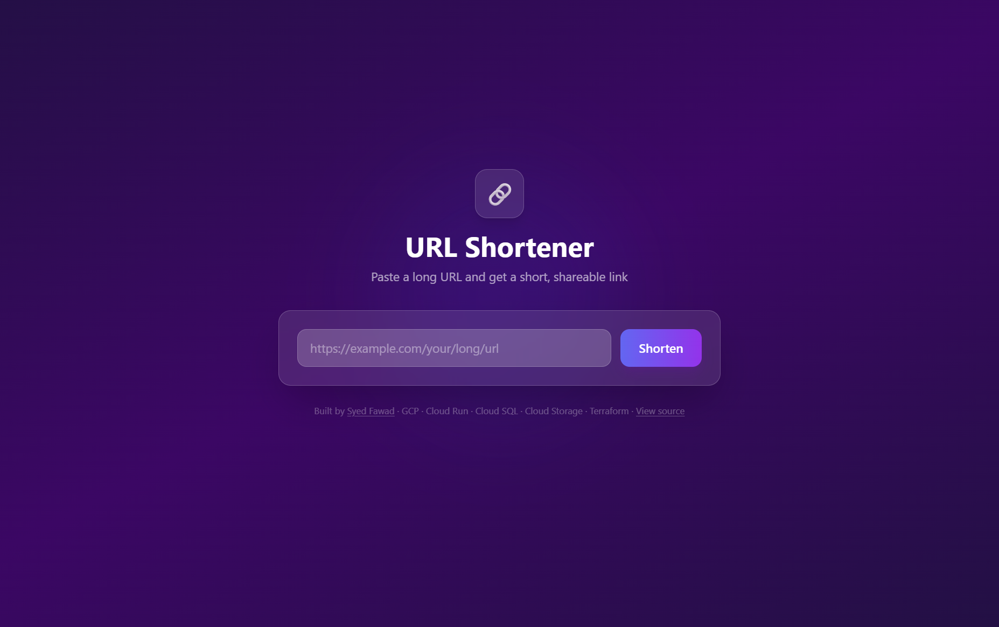

# URL Shortener

A production-realistic URL shortener built on GCP, demonstrating containerization, Infrastructure as Code, CI/CD best practices, and modern frontend design.

**Live demo:** https://storage.googleapis.com/urlshortener-488106-urlshortener-frontend/index.html



---

## Architecture

```
User
 ├── GET  /                → Cloud Storage (React SPA — Vite build, Tailwind CSS)
 │                              └── calls VITE_API_BASE (Cloud Run URL) at runtime
 │
 └── POST /api/shorten     → Cloud Run (Node.js / Express)
     GET  /r/:code         → Cloud Run (Node.js / Express)
                                └── Cloud SQL Auth Proxy (Unix socket, no VPC connector)
                                        └── Cloud SQL PostgreSQL 15 (private IP)
                                                └── Secret Manager (DB password at runtime)

GitHub Actions CI/CD
  PR   → lint backend + lint frontend + docker build validation
  main → build & push Docker image → Artifact Registry → deploy to Cloud Run
       → npm build (VITE_API_BASE injected) → gcloud storage rsync → Cloud Storage
```

---

## Stack

| Layer       | Technology                                      |
|-------------|-------------------------------------------------|
| Frontend    | React 19 + Vite + Tailwind CSS                  |
| Backend     | Node.js + Express + express-rate-limit          |
| Database    | Cloud SQL (PostgreSQL 15, db-f1-micro)          |
| Compute     | Cloud Run (serverless, scales to zero)          |
| DB Proxy    | Cloud SQL Auth Proxy (sidecar, Unix socket)     |
| Storage     | Cloud Storage (static frontend hosting)         |
| Registry    | Artifact Registry (Docker images)               |
| Secrets     | Secret Manager (runtime DB credentials)         |
| Networking  | VPC (Cloud SQL private IP)                      |
| IaC         | Terraform (modular, GCS remote state)           |
| CI/CD       | GitHub Actions                                  |

---

## Project Structure

```
.
├── .github/
│   └── workflows/
│       ├── ci.yml          # PR checks: lint (backend + frontend) + docker build
│       └── deploy.yml      # Push to main: build image → Cloud Run, build SPA → GCS
├── backend/
│   ├── src/
│   │   ├── db/pool.js      # PostgreSQL connection pool (pg)
│   │   ├── routes/
│   │   │   ├── shorten.js  # POST /api/shorten — validate URL, generate code, persist
│   │   │   └── redirect.js # GET /r/:code — LRU cache lookup → 302 redirect
│   │   └── index.js        # Express entrypoint, rate limiting, CORS, health check
│   └── Dockerfile
├── frontend/
│   ├── src/
│   │   ├── components/
│   │   │   ├── ShortenForm.jsx  # URL input form, POST /api/shorten
│   │   │   └── ResultCard.jsx   # Displays short link, clipboard copy
│   │   └── App.jsx
│   └── index.html
└── terraform/
    ├── main.tf             # Root module — wires all modules together
    ├── variables.tf
    ├── outputs.tf
    └── modules/
        ├── networking/         # VPC, private subnet, Cloud NAT
        ├── artifact-registry/  # Docker image repository
        ├── secret-manager/     # DB password secret + IAM binding
        ├── cloudsql/           # PostgreSQL instance (private IP only)
        ├── cloudrun/           # Cloud Run service, Cloud SQL Auth Proxy sidecar, IAM
        └── load-balancer/      # (optional) Global LB + CDN + SSL
```

---

## How It Works

1. **Shorten:** The React SPA sends `POST /api/shorten` with a URL to Cloud Run. The backend validates the URL using the `URL` constructor, generates a 7-character random code, and stores the mapping in Cloud SQL.

2. **Redirect:** `GET /r/:code` first checks an in-process LRU cache (5-minute TTL). On a cache miss it queries Cloud SQL, then returns a `302` redirect. `302` (not `301`) ensures browsers don't cache the redirect permanently, keeping click counts accurate.

3. **Database access:** Cloud Run runs a Cloud SQL Auth Proxy sidecar container that connects to Cloud SQL over a Unix domain socket — no VPC connector required.

4. **Secrets:** The DB password is stored in Secret Manager and mounted as an environment variable at Cloud Run startup. GitHub Secrets are used only by the CI/CD pipeline for deployment credentials.

5. **Frontend hosting:** The Vite build output is uploaded to Cloud Storage via `gcloud storage rsync`. Content-hashed assets (`/assets/**`) receive a 1-year immutable cache header; `index.html` is set to no-cache so users always get the latest entry point.

6. **Rate limiting:** `/api/shorten` is limited to 20 requests per minute per IP using `express-rate-limit`, with `trust proxy: 1` set so the limiter sees the real client IP behind Cloud Run's load balancer.

---

## Prerequisites

- GCP project with billing enabled
- GCS bucket for Terraform remote state
- `gcloud` CLI authenticated (`gcloud auth application-default login`)
- `terraform` >= 1.6
- `docker`
- Node.js >= 20

---

## Getting Started

### 1. Provision Infrastructure (Terraform)

```bash
cd terraform

# Copy and fill in your values
cp terraform.tfvars.example terraform.tfvars

terraform init   # downloads providers, configures GCS remote state
terraform plan   # review what will be created
terraform apply  # provision all GCP resources
```

Terraform outputs the Cloud Run service URL and frontend bucket name — you'll need these for the next steps.

### 2. Configure GitHub Actions Secrets

Go to **Settings → Secrets and variables → Actions** in your fork and add:

| Secret              | Description                                                    |
|---------------------|----------------------------------------------------------------|
| `GCP_PROJECT_ID`    | GCP project ID                                                 |
| `GCP_REGION`        | GCP region (e.g. `us-central1`)                                |
| `GCP_SA_KEY`        | Service account JSON key (download from IAM → Service Accounts)|
| `AR_REPO`           | Artifact Registry repo URL (e.g. `us-central1-docker.pkg.dev/project-id/repo-name`) |
| `CLOUD_RUN_SERVICE` | Cloud Run service name                                         |
| `CLOUD_RUN_URL`     | Public Cloud Run URL (e.g. `https://api-xyz-uc.a.run.app`)    |
| `FRONTEND_BUCKET`   | GCS bucket name for frontend (without `gs://`)                 |

### 3. Deploy

Push to `main` to trigger the full deploy pipeline:

```bash
git push origin main
```

The `deploy.yml` workflow will:
1. Build the Docker image and push it to Artifact Registry
2. Update the Cloud Run service to the new image
3. Build the React SPA with `VITE_API_BASE` set to your Cloud Run URL
4. Upload the build to Cloud Storage with proper cache-control headers

### 4. Local Development

**Backend:**
```bash
cd backend
npm install
cp .env.example .env
# Edit .env — set DATABASE_URL to a local PostgreSQL connection string
npm run dev         # starts on http://localhost:8080
```

**Frontend:**
```bash
cd frontend
npm install
npm run dev         # starts on http://localhost:5173
# Vite proxies /api/* and /r/* to http://localhost:8080
```

---

## API Reference

| Method | Path               | Description                          |
|--------|--------------------|--------------------------------------|
| POST   | `/api/shorten`     | Create a short URL                   |
| GET    | `/api/stats/:code` | Get click count and metadata         |
| GET    | `/r/:code`         | Redirect to original URL (302)       |
| GET    | `/healthz`         | Health check (returns `OK`)          |

### POST /api/shorten

```json
// Request
{ "url": "https://example.com/very/long/path" }

// Response 201
{ "code": "abc1234", "originalUrl": "https://example.com/very/long/path" }

// Response 400 (invalid URL or rate limit exceeded)
{ "error": "Invalid URL. Must start with http:// or https://" }
```

Rate limit: **20 requests / minute** per IP.

---

## Design Decisions

| Decision | Choice | Rationale |
|----------|--------|-----------|
| Redirect status | `302` | `301` is cached permanently by browsers, breaking click tracking |
| DB proxy | Cloud SQL Auth Proxy sidecar | No VPC connector cost; secure Unix socket connection |
| Frontend hosting | Cloud Storage | Simpler than Cloud Run for static files; cheap/free at low traffic |
| Cache | In-process LRU (node-cache) | Avoids Memorystore cost; sufficient for portfolio scale |
| URL validation | `new URL()` constructor | Spec-compliant; rejects malformed URLs that a regex would pass |
| IAM | Resource-scoped where possible | Secret Manager IAM bound to the specific secret, not the whole project |
